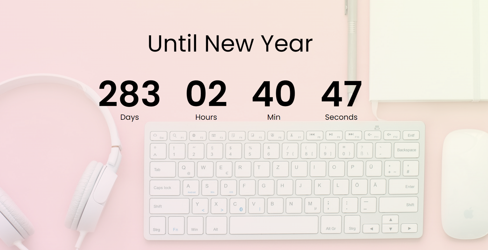

# **Project: CountDown Timer**

**Demo Link:**[ Countdown Timer Demo](https://noor-ismot.github.io/Countdown-Timer/)

**Programming Language:** HTML, CSS, Javascript

**Project Description:**

I created a Countdown Timer responsive web application using HTML, CSS, and JavaScript to count down the time until the next New Year's Day. The application displays the remaining time in days, hours, minutes, and seconds, updating in real-time.

**Challenges Faced:**

One challenge I encountered was accurately calculating the time remaining until the target date while ensuring the countdown displayed correctly. I overcame this challenge by implementing a function to calculate the time difference between the target date and the current date, converting it to days, hours, minutes, and seconds.
